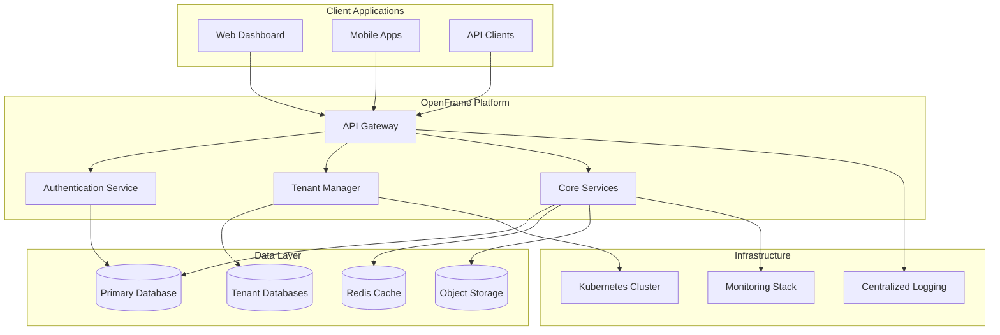

<p align="center">
  <picture>
    <source media="(prefers-color-scheme: dark)" srcset="docs/assets/logo-dark.png">
    <source media="(prefers-color-scheme: light)" srcset="docs/assets/logo-light.png">
    
  </picture>
</p>

<p align="center">
  <b>🌟 Open-Source Multi-Tenant Platform for Modern Applications</b>
</p>

<p align="center">
  <a href="https://github.com/yourusername/openframe-oss-tenant/actions"></a>
  <a href="https://github.com/yourusername/openframe-oss-tenant/releases"></a>
  <a href="https://github.com/yourusername/openframe-oss-tenant/blob/main/LICENSE"></a>
  <a href="https://discord.gg/your-discord"></a>
  <a href="https://github.com/yourusername/openframe-oss-tenant/stargazers"></a>
</p>

<p align="center">
  <a href="#-quick-start">Quick Start</a> •
  <a href="#-documentation">Documentation</a> •
  <a href="#-demo">Demo</a> •
  <a href="#-community">Community</a> •
  <a href="#-contributing">Contributing</a>
</p>

---

## ✨ Highlights

OpenFrame OSS Tenant is a powerful, production-ready multi-tenant platform that enables organizations to rapidly deploy scalable applications with enterprise-grade security and isolation.

🚀 **Rapid Deployment** - Get your multi-tenant application running in minutes, not months  
🔒 **Enterprise Security** - Built-in tenant isolation, RBAC, and compliance-ready features  
⚡ **High Performance** - Optimized for scale with intelligent resource management  
🛠️ **Developer Friendly** - Comprehensive APIs, SDKs, and extensive documentation  
🌍 **Cloud Native** - Kubernetes-first design with Docker support  
📊 **Real-time Analytics** - Built-in monitoring, metrics, and tenant insights  

## 🏗️ Architecture



## 🚀 Quick Start

Get OpenFrame running locally in under 5 minutes:

```bash
curl -fsSL https://get.openframe.dev/install.sh | sh
```

Or clone and run manually:

```bash
# Clone the repository
git clone https://github.com/yourusername/openframe-oss-tenant.git
cd openframe-oss-tenant

# Start with Docker Compose
docker-compose up -d

# Or run locally
npm install
npm run dev
```

🎉 **That's it!** Your OpenFrame instance is now running at `http://localhost:3000`

**Default credentials:**
- Email: `admin@openframe.dev`
- Password: `admin123` (⚠️ Change this immediately in production)

## ☸️ Deployment Options

### Docker (Recommended for Development)

```bash
docker run -d \
  --name openframe \
  -p 3000:3000 \
  -e DATABASE_URL=postgresql://user:pass@db:5432/openframe \
  openframe/oss-tenant:latest
```

### Kubernetes (Production Ready)

```yaml
# Quick deploy to k8s
kubectl apply -f https://raw.githubusercontent.com/yourusername/openframe-oss-tenant/main/deploy/k8s/
```

### Helm Chart

```bash
helm repo add openframe https://charts.openframe.dev
helm install my-openframe openframe/oss-tenant
```

## 🛠️ Integrations

| Integration | Status | Description |
|-------------|--------|-------------|
| **PostgreSQL** | ✅ Primary | Default database with full tenant isolation |
| **MySQL** | ✅ Supported | Alternative database option |
| **Redis** | ✅ Primary | Session storage and caching |
| **Docker** | ✅ Primary | Container deployment |
| **Kubernetes** | ✅ Primary | Orchestration and scaling |
| **Auth0** | ✅ Supported | Enterprise authentication |
| **Okta** | ✅ Supported | SSO integration |
| **Stripe** | ✅ Supported | Subscription billing |
| **AWS S3** | ✅ Supported | File storage |
| **Cloudflare** | ✅ Supported | CDN and security |

## 🖼️ Screenshots

<details>
<summary>📱 <strong>Dashboard Overview</strong></summary>


*Modern tenant management dashboard with real-time analytics*

</details>

<details>
<summary>🏢 <strong>Tenant Management</strong></summary>


*Comprehensive tenant creation and management interface*

</details>

<details>
<summary>📊 <strong>Analytics & Monitoring</strong></summary>


*Real-time monitoring and usage analytics per tenant*

</details>

## 🗺️ Roadmap

- [x] ~~Multi-tenant architecture~~
- [x] ~~Docker containerization~~
- [x] ~~Kubernetes deployment~~
- [x] ~~REST API v1~~
- [ ] 🔄 GraphQL API (In Progress)
- [ ] 📱 Mobile SDKs (iOS/Android)
- [ ] 🌐 Multi-region deployment
- [ ] 🔒 Advanced RBAC system
- [ ] 📈 Enhanced analytics dashboard
- [ ] 🤖 AI-powered tenant insights
- [ ] 🔌 Plugin system
- [ ] 📚 White-label solutions

> Want to contribute to the roadmap? [Join our discussions](https://github.com/yourusername/openframe-oss-tenant/discussions) or [propose new features](https://github.com/yourusername/openframe-oss-tenant/issues/new?template=feature_request.md).

## 🤝 Contributing

We love your input! We want to make contributing as easy and transparent as possible. Please see our [Contributing Guide](CONTRIBUTING.md) for details.

### Development Setup

```bash
# 1. Fork and clone the repo
git clone https://github.com/your-username/openframe-oss-tenant.git

# 2. Install dependencies
npm install

# 3. Set up environment
cp .env.example .env.local
# Edit .env.local with your configuration

# 4. Start development server
npm run dev

# 5. Run tests
npm test
```

### Code of Conduct

This project adheres to a [Code of Conduct](CODE_OF_CONDUCT.md). By participating, you're expected to honor this code.

## 💬 Community & Support

- 💬 **Discord**: [Join our community](https://discord.gg/your-discord)
- 📚 **Documentation**: [docs.openframe.dev](https://docs.openframe.dev)
- 🐛 **Bug Reports**: [GitHub Issues](https://github.com/yourusername/openframe-oss-tenant/issues)
- 💡 **Feature Requests**: [GitHub Discussions](https://github.com/yourusername/openframe-oss-tenant/discussions)
- 📧 **Email**: support@openframe.dev

## 📋 FAQ

<details>
<summary><strong>Is OpenFrame suitable for production use?</strong></summary>

Yes! OpenFrame is production-ready and used by companies worldwide. We recommend following our [Production Deployment Guide](docs/production-deployment.md) for best practices.

</details>

<details>
<summary><strong>How does tenant isolation work?</strong></summary>

OpenFrame provides multiple isolation levels:
- **Database isolation**: Separate databases per tenant
- **Schema isolation**: Shared database with separate schemas  
- **Row-level security**: Shared tables with RLS policies

</details>

<details>
<summary><strong>Can I self-host OpenFrame?</strong></summary>

Absolutely! OpenFrame is designed to be self-hosted. Check our [Self-Hosting Guide](docs/self-hosting.md) to get started.

</details>

<details>
<summary><strong>What's the difference between this and SaaS solutions?</strong></summary>

OpenFrame gives you complete control over your data, infrastructure, and customizations without vendor lock-in. Plus, it's free and open-source!

</details>

## 🔒 Security & License

### Security Policy

Found a security vulnerability? Please read our [Security Policy](SECURITY.md) and report it responsibly.

### License

This project is licensed under the **MIT License** - see the [LICENSE](LICENSE) file for details.

```
Copyright (c) 2025 OpenFrame Contributors

Permission is hereby granted, free of charge, to any person obtaining a copy
of this software and associated documentation files...
```

---

<p align="center">
  <strong>Built with 💖 by the Flamingo team in Miami Beach, FL</strong><br>
  <sub>Star ⭐ this repo if you find it useful!</sub>
</p>

<p align="center">
  <a href="https://openframe.dev">🌐 Website</a> •
  <a href="https://docs.openframe.dev">📚 Docs</a> •
  <a href="https://twitter.com/openframedev">🐦 Twitter</a> •
  <a href="https://linkedin.com/company/openframe">💼 LinkedIn</a>
</p>

<p align="center">
  
</p>
