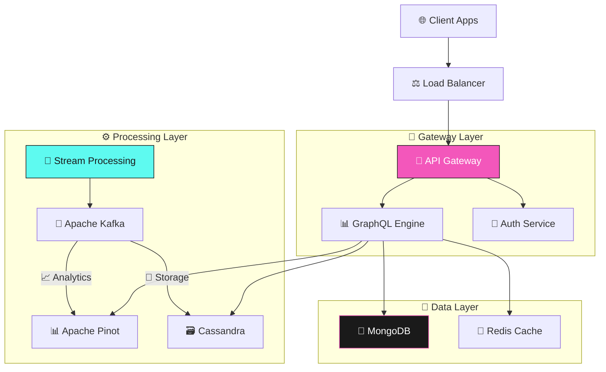

# 🦩 OpenFrame OSS Tenant

<div align="center">


**The enterprise-grade unified platform for data, APIs, automation, and AI**

[](LICENSE)
[](https://www.flamingo.run/knowledge-base)
[](https://github.com/flamingo-stack/openframe-oss-tenant/stargazers)
[](https://hub.docker.com/r/flamingo/openframe)
[](https://www.linkedin.com/showcase/openframemsp)

[🚀 Quick Start](#-quick-start) • [📖 Documentation](https://www.flamingo.run/knowledge-base) • [🌐 Website](https://www.flamingo.run/) • [💬 Community](https://www.linkedin.com/showcase/openframemsp)

</div>

## ✨ Highlights

OpenFrame creates a **unified layer** for data, APIs, automation, and AI on top of carefully selected open-source projects, simplifying IT and security operations through a single, cohesive platform.

- **🎯 Unified Dashboard** → Single interface for managing all services and workflows
- **🤖 Smart Automation** → Automated deployment and monitoring capabilities  
- **🧠 AI-Powered Insights** → Real-time anomaly detection and AI assistants
- **🔐 Enterprise Security** → Integrated security controls across all services
- **⚡ High Performance** → Handles 100,000 events/second with sub-500ms latency
- **📈 Scalable Architecture** → Built on proven microservices principles

## 🏗️ Architecture

OpenFrame uses a modern microservices architecture designed for enterprise-scale operations:



## 🚀 Quick Start

Get OpenFrame running locally in under 5 minutes:

### One-Line Installation

```bash
curl -fsSL https://raw.githubusercontent.com/flamingo-stack/openframe-oss-tenant/main/scripts/install.sh | bash
```

### Platform-Specific Scripts

<details>
<summary><b>🪟 Windows</b></summary>

```powershell
# Interactive mode
.\scripts\run-windows.ps1

# Silent mode
.\scripts\run-windows.ps1 -Silent

# Show help
.\scripts\run-windows.ps1 -Help
```

Features automatic tool installation (kind, kubectl, helm, skaffold, jq, telepresence) and Docker Desktop integration.

</details>

<details>
<summary><b>🍎 macOS</b></summary>

```bash
# Interactive mode
./scripts/run-mac.sh

# Silent mode  
./scripts/run-mac.sh --silent

# Show help
./scripts/run-mac.sh --help
```

</details>

<details>
<summary><b>🐧 Linux</b></summary>

```bash
# Interactive mode
./scripts/run-linux.sh

# Silent mode
./scripts/run-linux.sh --silent

# Show help  
./scripts/run-linux.sh --help
```

</details>

### 🔑 GitHub Token Setup

Create a GitHub Personal Access Token (Classic) with these permissions:
- `repo` - Full control of private repositories
- `read:packages` - Read access to packages  
- `write:packages` - Write access to packages

**Create Token:** [GitHub Settings → Developer Settings → Personal Access Tokens](https://github.com/settings/tokens)

### 🌐 Access Your Instance

Once started, OpenFrame will be available at:

- **🎛️ UI Dashboard:** [http://localhost:8080](http://localhost:8080)
- **🔗 GraphQL API:** [http://localhost:8080/graphql](http://localhost:8080/graphql)  
- **⚙️ Config Server:** [http://localhost:8888](http://localhost:8888)

## ☸️ Deployment

### Docker Compose (Recommended for Development)

```bash
# Clone and start
git clone https://github.com/flamingo-stack/openframe-oss-tenant.git
cd openframe-oss-tenant
docker-compose up -d
```

### Kubernetes (Production)

```bash
# Install via Helm
helm repo add flamingo https://charts.flamingo.run
helm install openframe flamingo/openframe --namespace openframe --create-namespace

# Or apply manifests directly
kubectl apply -f k8s/
```

### Cloud Providers

| Provider | Status | Documentation |
|----------|---------|---------------|
| ☁️ **AWS EKS** | ✅ Supported | [AWS Guide](docs/deployment/aws.md) |
| ☁️ **Google GKE** | ✅ Supported | [GCP Guide](docs/deployment/gcp.md) |
| ☁️ **Azure AKS** | ✅ Supported | [Azure Guide](docs/deployment/azure.md) |
| ☁️ **DigitalOcean** | 🔄 Beta | [DO Guide](docs/deployment/digitalocean.md) |

## 🖼️ Screenshots

<div align="center">

### Dashboard Overview


### Real-time Monitoring  


### Service Management


</div>

## 🛠️ Integrations

OpenFrame seamlessly integrates with your existing tools and infrastructure:

### Data & Analytics
- **🍃 MongoDB** - Application data storage
- **🗃️ Cassandra** - Event storage and time-series data
- **📊 Apache Pinot** - Real-time analytics engine
- **🔴 Redis** - Caching and rate limiting

### Stream Processing  
- **📨 Apache Kafka** - Event streaming platform
- **🌊 Custom Stream Service** - Data processing and enrichment
- **🚨 Anomaly Detection** - AI-powered insights

### DevOps & Infrastructure
- **☸️ Kubernetes** - Container orchestration
- **🕸️ Istio** - Service mesh
- **📊 Prometheus + Grafana** - Monitoring stack
- **📝 Loki** - Log aggregation

## 🗺️ Roadmap

- [x] ✅ Core platform and microservices architecture
- [x] ✅ GraphQL API and authentication system  
- [x] ✅ Real-time stream processing with Kafka
- [x] ✅ Vue.js dashboard with responsive design
- [ ] 🔄 Advanced AI/ML pipeline integrations
- [ ] 🔄 Multi-cloud deployment automation
- [ ] 🔄 Enhanced security scanning and compliance
- [ ] 📋 Extended third-party tool integrations
- [ ] 📋 Advanced analytics and reporting features
- [ ] 📋 Mobile application support

## 🤝 Contributing

We welcome contributions from the community! Here's how you can help:

### Development Setup

```bash
# Prerequisites
java --version  # OpenJDK 21+
node --version  # Node.js 18+
rustc --version # Rust 1.70+
docker --version # Docker 24.0+

# Build all services
mvn clean install

# Run tests
mvn test

# Start development
./scripts/run-local.sh
```

### Ways to Contribute

- 🐛 **Report Bugs** - [Open an Issue](https://github.com/flamingo-stack/openframe-oss-tenant/issues/new?template=bug_report.md)
- 💡 **Request Features** - [Feature Request](https://github.com/flamingo-stack/openframe-oss-tenant/issues/new?template=feature_request.md)
- 📝 **Improve Docs** - Help us make documentation better
- 🔧 **Submit PRs** - Check our [Contributing Guide](CONTRIBUTING.md)

## 🔒 Security

OpenFrame is built with enterprise security in mind:

- **🔐 OAuth 2.0 + JWT** authentication
- **🔒 AES-256** encryption for sensitive data
- **📋 Comprehensive audit** logging
- **🏢 Multi-tenant** isolation
- **⚡ Rate limiting** and circuit breakers
- **🛡️ Security scanning** in CI/CD

**Found a security issue?** Please email security@flamingo.run instead of opening a public issue.

## 📄 License

This project is licensed under the [Apache License 2.0](LICENSE.md).

```
Copyright 2025 Flamingo Technologies

Licensed under the Apache License, Version 2.0 (the "License");
you may not use this file except in compliance with the License.
You may obtain a copy of the License at

    http://www.apache.org/licenses/LICENSE-2.0

Unless required by applicable law or agreed to in writing, software
distributed under the License is distributed on an "AS IS" BASIS,
WITHOUT WARRANTIES OR CONDITIONS OF ANY KIND, either express or implied.
See the License for the specific language governing permissions and
limitations under the License.
```

---

<div align="center">

**Built with ❤️ by the [🦩 Flamingo](https://www.flamingo.run/) team**

[🌐 Website](https://www.flamingo.run/) • [📖 Documentation](https://www.flamingo.run/knowledge-base) • [💼 LinkedIn](https://www.linkedin.com/showcase/openframemsp) • [📧 Contact](mailto:hello@flamingo.run)

</div>
