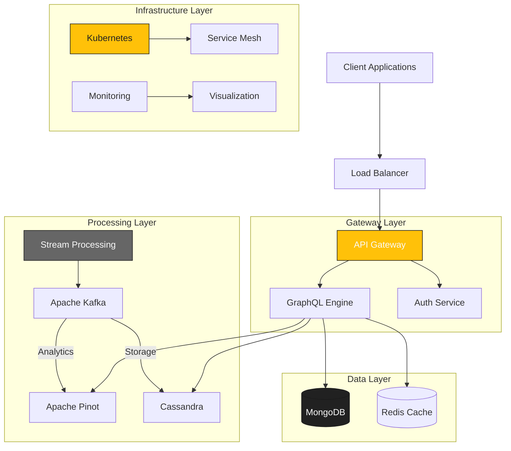

<div align="center">
  <picture>
    <!-- Dark theme -->
    <source media="(prefers-color-scheme: dark)" srcset="docs/assets/logo-openframe-full-dark-bg.png">
    <!-- Light theme -->
    <source media="(prefers-color-scheme: light)" srcset="docs/assets/logo-openframe-full-light-bg.png">
    <!-- Default / fallback -->
    
  </picture>

  <p><b>A distributed platform that creates a unified layer for data, APIs, automation, and AI on top of carefully selected open-source projects. We simplify IT and security operations through a single, cohesive platform.</b></p>

  <p>
    <a href="LICENSE.md">
      
    </a>
    <a href="https://github.com/flamingo-stack/openframe-oss-tenant/releases">
      
    </a>
    <a href="https://www.flamingo.run/knowledge-base">
      
    </a>
    <a href="https://www.openmsp.ai/">
      
    </a>
  </p>
</div>

---

## Quick Links

- [Quick Start](#quick-start)  
- [Documentation](https://www.flamingo.run/knowledge-base)  
- [Community](https://www.openmsp.ai/)  
- [Security](#security)  

---

## Highlights

- **Unified Dashboard** - Single interface for managing all services and workflows  
- **Smart Automation** - Automated deployment and monitoring capabilities  
- **AI-Powered Insights** - Real-time anomaly detection and intelligent assistants  
- **Enterprise Security** - Integrated security controls across all services  
- **High Performance** - Handles 100,000+ events/second with sub-500ms latency  
- **Scalable Architecture** - Built on proven microservices principles  

---

## Architecture

OpenFrame uses a modern microservices architecture with four key layers:



## Quick Start

Get OpenFrame running locally in under 5 minutes! Choose your platform:

### Windows
```powershell
# Interactive mode
.\scripts\run-windows.ps1

# Silent mode
.\scripts\run-windows.ps1 -Silent
```

### MacOS
```bash
# Interactive mode
./scripts/run-mac.sh

# Silent mode  
./scripts/run-mac.sh --silent
```

### Linux
```bash
# Interactive mode
./scripts/run-linux.sh

# Silent mode
./scripts/run-linux.sh --silent
```

### Authentication Setup

Create a GitHub Personal Access Token (Classic) with these permissions:
- `repo` - Full control of private repositories
- `read:packages` - Read access to packages  
- `write:packages` - Write access to packages

[Create token →](https://github.com/settings/tokens)


### Access Your Instance

Once started, OpenFrame will be available at:
- **UI Dashboard:** http://localhost:8080
- **GraphQL API:** http://localhost:8080/graphql
- **Config Server:** http://localhost:8888


## Deployment Options

### Docker Compose (Development)
```bash
# Build and start all services
docker-compose up -d

# View logs
docker-compose logs -f
```

### Kubernetes (Production)
```bash
# Deploy to Kubernetes cluster
kubectl apply -f k8s/

# Check deployment status
kubectl get pods -n openframe
```

## Screenshots

### Dashboard Overview


### Devices


### Policies & Compliance


</div>

## Technology Stack

| Component | Technology | Purpose |
|-----------|------------|---------|
| **Backend** | Spring Boot 3.3 + Java 21 | Core runtime & APIs |
| **Frontend** | Vue 3 + TypeScript + PrimeVue | Modern web interface |
| **Agent** | Rust + Tokio | Cross-platform system agent |
| **API Layer** | GraphQL + Netflix DGS | Unified data access |
| **Message Queue** | Apache Kafka 3.6 | Event streaming |
| **Databases** | MongoDB + Cassandra + Pinot | Multi-model data storage |
| **Cache** | Redis | High-performance caching |
| **Orchestration** | Kubernetes + Istio | Container management |
| **Monitoring** | Prometheus + Grafana + Loki | Observability stack |

## Roadmap

- [x] Core microservices architecture
- [x] GraphQL API with authentication  
- [x] Real-time stream processing
- [x] Cross-platform Rust agent
- [x] Vue 3 dashboard interface
- [ ] **Multi-tenant support** *(Q2 2025)*
- [ ] **Advanced AI/ML integrations** *(Q3 2025)*
- [ ] **Edge computing capabilities** *(Q4 2025)*
- [ ] **Mobile companion app** *(2026)*

## Development Setup

### Prerequisites
- **Java:** OpenJDK 21.0.1+
- **Node.js:** 18+ with npm
- **Rust:** 1.70+ with Cargo
- **Docker:** 24.0+ with Docker Compose
- **Git:** 2.42+

### Local Development
```bash
# Clone the repository
git clone https://github.com/flamingo-stack/openframe-oss-tenant.git
cd openframe-oss-tenant

# Build backend services
mvn clean install

# Start frontend development server
cd openframe/services/openframe-frontend
npm install && npm run dev

# Build Rust agent
cd ../../client
cargo build --release
```

### Running Tests
```bash
# Java tests
mvn test

# Frontend tests
cd openframe/services/openframe-frontend
npm run type-check

# Rust tests  
cd client
cargo test
```

## Contributing

We love contributions! Please see our [Contributing Guide](CONTRIBUTING.md) for details.

### Quick Contributing Steps:
1. Fork the project
2. Create your feature branch (`git checkout -b feature/amazing-feature`)
3. Commit your changes (`git commit -m 'Add amazing feature'`)
4. Push to the branch (`git push origin feature/amazing-feature`)
5. Open a Pull Request

## Documentation

| Guide | Description |
|-------|-------------|
| [Getting Started](docs/getting-started/introduction.md) | Quick start guide and basic concepts |
| [Architecture](docs/development/architecture/overview.md) | System design and components |
| [Development Setup](docs/development/setup/environment.md) | Local development environment |
| [API Reference](docs/api/README.md) | GraphQL schema and endpoints |
| [Deployment](docs/deployment/README.md) | Production deployment guide |
| [Operations](docs/operations/README.md) | Monitoring and maintenance |

## FAQ

<details>
<summary><strong>How does OpenFrame compare to other platforms?</strong></summary>

OpenFrame uniquely combines data processing, API management, and AI capabilities in a single unified platform, while most alternatives focus on just one area.
</details>

<details>
<summary><strong>What's the minimum hardware requirement?</strong></summary>

For development: 8GB RAM, 4 CPU cores, 20GB storage. For production: 16GB RAM, 8 CPU cores, 100GB storage minimum.
</details>

<details>
<summary><strong>Can I use OpenFrame with existing infrastructure?</strong></summary>

Yes! OpenFrame is designed to integrate with existing systems through its flexible API layer and standard protocols.
</details>

<details>
<summary><strong>Is there commercial support available?</strong></summary>

Yes, enterprise support is available through [Flamingo](https://www.flamingo.run). Contact us for details.
</details>

## Security

OpenFrame takes security seriously. We implement:

- **OAuth 2.0 + JWT** authentication
- **AES-256** encryption for data at rest
- **Comprehensive** audit logging
- **Multi-tenant** isolation
- **Rate limiting** and circuit breakers
- **Real-time** security monitoring

Found a security issue? Please email security@flamingo.run instead of opening a public issue.

## License

This project is licensed under the [The Flamingo AI Unified License v1.0](LICENSE.md).

## Acknowledgments

- Thanks to all our [contributors](https://github.com/flamingo-stack/openframe-oss-tenant/graphs/contributors)
- Built with amazing open-source projects: Spring Boot, Vue.js, Apache Kafka, and many more
- Special thanks to the broader open-source community

---

<div align="center">
  <table border="0" cellspacing="0" cellpadding="0">
    <tr>
      <td align="center">
        Built with 💛 by the <a href="https://www.flamingo.run/about"><b>Flamingo</b></a> team
      </td>
      <td align="center">
        <a href="https://www.flamingo.run">Website</a> • 
        <a href="https://www.flamingo.run/knowledge-base">Knowledge Base</a> • 
        <a href="https://www.linkedin.com/showcase/openframemsp/about/">LinkedIn</a> • 
        <a href="https://www.openmsp.ai/">Community</a>
      </td>
    </tr>
  </table>
</div>
