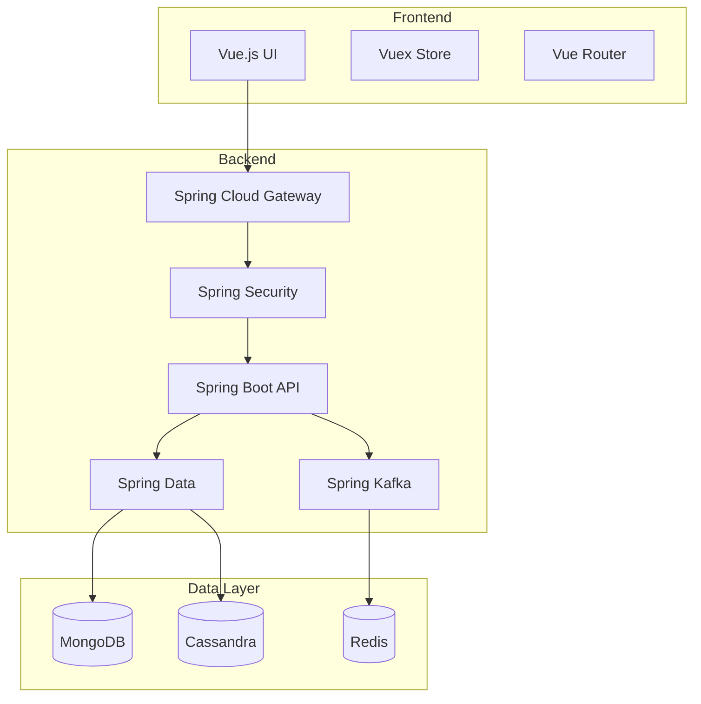
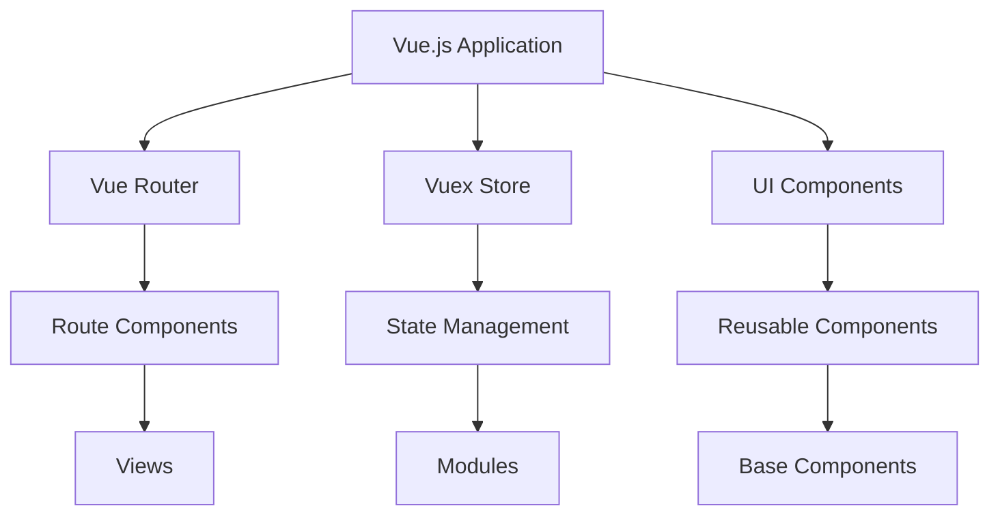
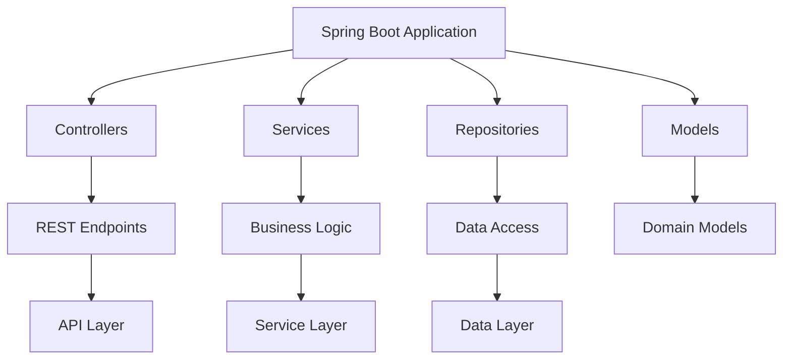

# Architecture Overview

This document outlines the architecture of OpenFrame's Java Spring Boot backend and Vue.js frontend.

## System Architecture



## Component Architecture

### Frontend Architecture



Key Components:
- **Vue.js**: Core frontend framework
- **Vuex**: State management
- **Vue Router**: Navigation and routing
- **Vue Test Utils**: Component testing
- **Playwright**: E2E testing

### Backend Architecture



Key Components:
- **Spring Boot**: Core application framework
- **Spring Security**: Authentication and authorization
- **Spring Data**: Data access layer
- **Spring Kafka**: Event streaming
- **Spring Cloud Gateway**: API gateway

## Development Patterns

### 1. Clean Architecture

```java
// Domain Layer
public class Device {
    private final String id;
    private final String name;
    private final DeviceStatus status;
    
    // Constructor, getters, etc.
}

// Application Layer
@Service
@RequiredArgsConstructor
public class DeviceService {
    private final DeviceRepository deviceRepository;
    
    public Device createDevice(CreateDeviceCommand command) {
        Device device = new Device(command.getName(), command.getType());
        return deviceRepository.save(device);
    }
}

// Infrastructure Layer
@Repository
public interface DeviceRepository extends MongoRepository<Device, String> {
    Optional<Device> findByDeviceId(String deviceId);
}
```

### 2. Repository Pattern

```java
// Repository Interface
public interface DeviceRepository {
    Optional<Device> findById(String id);
    List<Device> findByStatus(DeviceStatus status);
    Device save(Device device);
}

// Implementation
@Repository
public class MongoDeviceRepository implements DeviceRepository {
    private final MongoTemplate mongoTemplate;
    
    @Override
    public Optional<Device> findById(String id) {
        return Optional.ofNullable(
            mongoTemplate.findById(id, Device.class)
        );
    }
}
```

## Project Structure

```
openframe/
├── services/
│   ├── openframe-api/
│   │   ├── src/
│   │   │   ├── main/
│   │   │   │   └── java/
│   │   │   │       └── com/openframe/
│   │   │   │           ├── controller/
│   │   │   │           ├── service/
│   │   │   │           ├── repository/
│   │   │   │           └── model/
│   │   │   └── test/
│   │   └── pom.xml
│   └── openframe-frontend/
│       ├── src/
│       │   ├── components/
│       │   ├── views/
│       │   ├── store/
│       │   └── router/
│       └── package.json
└── libraries/
    ├── openframe-data/
    └── openframe-security/
```

## Technology Stack

### Backend
- **Framework**: Spring Boot 3.2.x
- **Language**: Java 21
- **Build Tool**: Maven 3.9.6+
- **Database**: MongoDB, Cassandra
- **Cache**: Redis
- **Message Broker**: Apache Kafka
- **API Gateway**: Spring Cloud Gateway
- **Security**: Spring Security with OAuth 2.0
- **Testing**: JUnit 5, Mockito, TestContainers

### Frontend
- **Framework**: Vue.js 3
- **Language**: TypeScript
- **Build Tool**: Vite
- **State Management**: Vuex
- **Routing**: Vue Router
- **UI Framework**: Vuetify
- **Testing**: Vue Test Utils, Playwright
- **Package Manager**: npm

### Infrastructure
- **Container Orchestration**: Kubernetes
- **Service Mesh**: Istio
- **Monitoring**: Prometheus, Grafana
- **Logging**: Loki
- **CI/CD**: GitHub Actions

## Next Steps

- [Development Setup](setup.md) - Set up your environment
- [API Documentation](../api/overview.md) - Learn about the API
- [Contributing](contributing.md) - Learn how to contribute
- [Testing](testing.md) - Learn about testing
- [Code Style](code-style.md) - Follow coding standards 