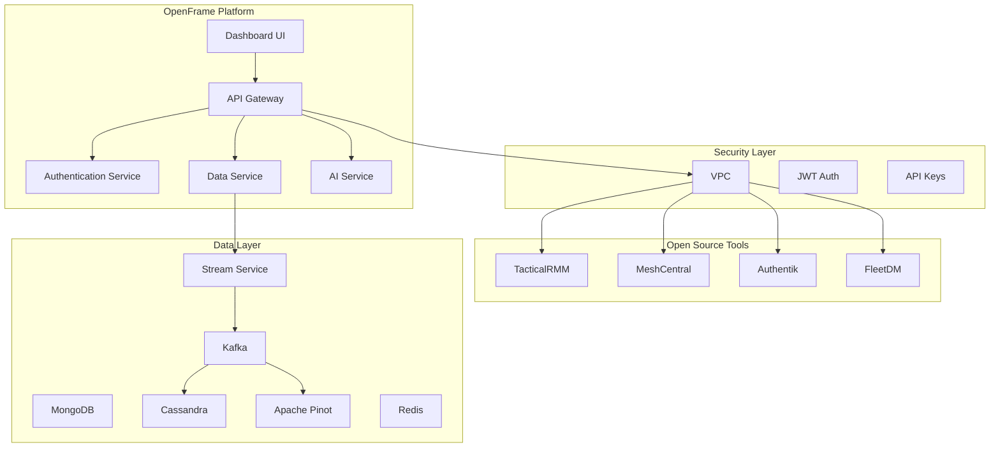
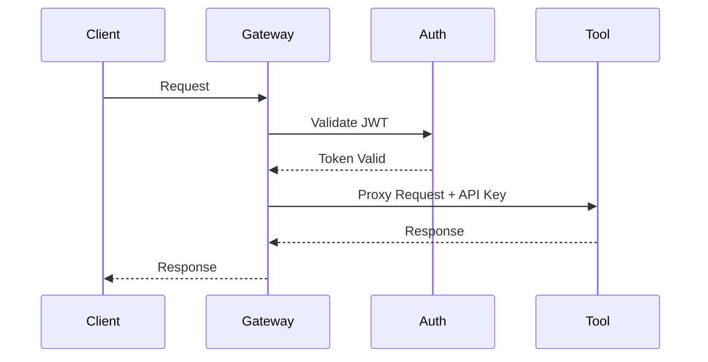
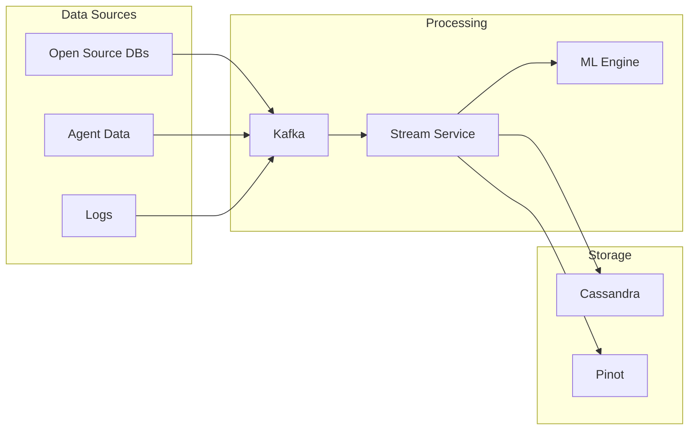

# OpenFrame Architecture Overview

OpenFrame is a comprehensive system that unifies various open-source IT and security products under a single platform, providing integrated data management, AI capabilities, dashboards, APIs, and security layers.

## System Architecture

## Core Components

### 1. Microservices Architecture
- **openframe-gateway**: API Gateway with JWT authentication and WebSocket support
- **openframe-api**: GraphQL API service with OAuth2/OpenID Connect
- **openframe-management**: Administrative service with scheduled tasks
- **openframe-stream**: Stream processing service using Kafka for event streaming
- **openframe-config**: Spring Cloud Config Server for centralized configuration
- **openframe-client**: Agent management and authentication service
- **openframe-frontend**: Vue 3 + TypeScript frontend with PrimeVue components

### 2. System Agent
- **Rust Client**: Cross-platform agent for system monitoring and management
- **Service Integration**: Runs as system service on Windows, macOS, and Linux
- **Auto-Update**: Integrated with Velopack for seamless updates
- **Secure Communication**: TLS-encrypted communication with platform

### 3. Security Layer
- **Authentication**: JWT-based with OAuth2/OpenID Connect via Spring Security
- **API Gateway**: Request proxying and authentication validation
- **Cookie-based JWT**: HTTP-only cookies converted to Authorization headers
- **Agent Authentication**: Separate authentication flow for system agents
- **Tool Integration**: Secure proxy for external tool APIs

### 4. Data Layer
- **Stream Processing Service**: Custom data pipeline management and stream processing
- **Apache Kafka 3.6.0**: High-throughput pub/sub messaging
- **MongoDB 7.x**: Application data and configurations
- **Cassandra 4.x**: Time-series event data and audit logs
- **Apache Pinot 1.2.0**: Real-time analytics and OLAP queries
- **Redis**: Caching and session storage

### 5. AI and Analytics
- **Stream Processing**: Real-time data enrichment and anomaly detection
- **ML/DL Integration**: Frameworks for intelligent operations
- **GraphQL Analytics**: Unified query interface for data access
- **Model Context Protocol**: AI workflow integration support

### 6. Frontend and User Interface
- **Vue 3**: Modern reactive frontend with Composition API
- **PrimeVue**: Comprehensive component library
- **Apollo Client**: GraphQL integration with caching
- **Pinia**: State management with TypeScript support
- **Real-time Updates**: WebSocket integration for live data

## Key Features

1. **Unified Access**
   - Single authentication point
   - Centralized API management
   - Secure proxy for all tools

2. **Data Integration**
   - Real-time data streaming
   - Unified data structure
   - Advanced analytics capabilities

3. **Intelligent Operations**
   - AI-powered issue resolution
   - Automated problem detection
   - Smart orchestration

4. **Comprehensive Monitoring**
   - Unified monitoring dashboard
   - Integrated logging
   - Performance analytics

## Security Architecture

## Data Flow Architecture

## Next Steps

- [Detailed Component Documentation](./components/)
- [Security Implementation](./security/)
- [Data Pipeline Architecture](./data-pipeline/)
- [AI and Analytics](./ai-analytics/)
- [API Integration](./api-integration/)
- [Deployment Guide](../deployment/) 